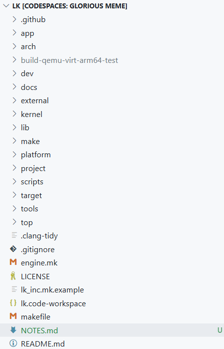
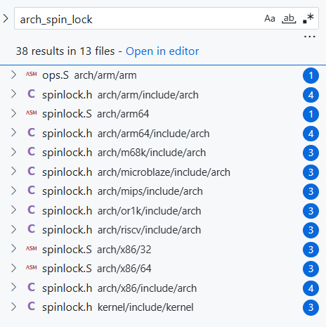

### This post contain the notes taken during reverse engineering of LK folder structure

* **.github** - it contains build script like yaml files
* **app** - applications. This runs at the very top after initialisation like a Android or linux application
    * app_init() wrapper function to initialize all apps one-by-one.
* **arch** - different CPU architectures like RISCV, ARM64, ARM, MIPS, x86, etc.
    * these implementations are tightly coupled with the processor the CPU
    * CPU specific features are added to these **arch**
    * function name would remain same across different archs except for the actual functionality
        - arm-m - nvic
        - arm64 - gic
    * certain functionality requires specific assembly/code implementations in the particular architecture
    * in short, ***arch folder contains copies of functionalities (for example, spinlock.h) implemened for specific architectures***
    
* **dev**
* **docs**
* **external**
* **kernel**
* **lib**
* **make**
* **platform**
* **project**
* **scripts**
* **target**
* **tools**
* **top**